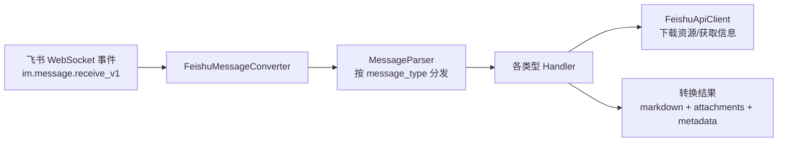
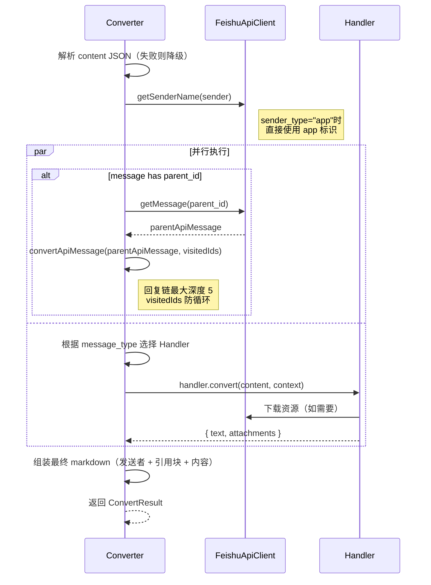

# 技术设计文档

## 架构概览



## 技术栈

| 技术 | 选型 | 理由 |
|------|------|------|
| 语言 | TypeScript 5.x | 用户要求，强类型保障 |
| 模块 | ESM 优先，同时输出 CJS | 用户要求 |
| 构建 | tsup | 零配置，同时输出 ESM/CJS |
| 运行时 | Node.js >= 18 | 原生 fetch、稳定 ESM 支持 |
| 包管理 | pnpm | 用户偏好 |
| HTTP | 原生 fetch | Node 18+ 内置，无需额外依赖 |
| 测试 | vitest | 快速、ESM 原生支持、与 TypeScript 无缝集成 |
| 零依赖 | 无运行时依赖 | 作为 SDK 包应尽量轻量，只依赖 Node.js 内置 API |

## 目录结构

```
feishu-message-for-llm/
├── src/
│   ├── index.ts                    # 包入口，导出 FeishuMessageConverter
│   ├── converter.ts                # FeishuMessageConverter 主类
│   ├── api-client.ts               # FeishuApiClient：token 管理 + API 调用
│   ├── types.ts                    # 所有 TypeScript 类型定义
│   ├── handlers/
│   │   ├── index.ts                # Handler 注册表
│   │   ├── text.ts                 # text 消息处理
│   │   ├── post.ts                 # post 富文本处理
│   │   ├── image.ts                # image 消息处理
│   │   ├── file.ts                 # file 消息处理
│   │   ├── folder.ts               # folder 消息处理
│   │   ├── audio.ts                # audio 消息处理
│   │   ├── media.ts                # media 视频处理
│   │   ├── sticker.ts              # sticker 贴纸处理
│   │   ├── share-chat.ts           # share_chat 群聊卡片
│   │   ├── share-user.ts           # share_user 用户卡片
│   │   ├── merge-forward.ts        # merge_forward 合并转发
│   │   ├── interactive.ts          # interactive 卡片消息
│   │   ├── hongbao.ts              # hongbao 红包
│   │   ├── location.ts             # location 位置
│   │   ├── calendar.ts             # 日程相关（3种类型）
│   │   ├── video-chat.ts           # video_chat 视频通话
│   │   ├── todo.ts                 # todo 任务
│   │   ├── vote.ts                 # vote 投票
│   │   ├── system.ts               # system 系统消息
│   │   └── unknown.ts              # 未知类型兜底
│   └── utils/
│       ├── mention.ts              # @提及替换工具
│       ├── style.ts                # 文本样式处理（bold/italic/underline/lineThrough）
│       ├── doc-link.ts             # 飞书云文档链接识别与富化
│       ├── time.ts                 # 时间戳格式化
│       ├── text-file.ts            # 文本文件类型判断
│       └── sanitize.ts             # 文件名清洗（跨平台安全）
├── tests/
│   ├── unit/
│   │   ├── handlers/               # 每个 handler 的单元测试
│   │   │   ├── text.test.ts
│   │   │   ├── post.test.ts
│   │   │   ├── image.test.ts
│   │   │   ├── file.test.ts
│   │   │   ├── folder.test.ts
│   │   │   ├── audio.test.ts
│   │   │   ├── media.test.ts
│   │   │   ├── sticker.test.ts
│   │   │   ├── share-chat.test.ts
│   │   │   ├── share-user.test.ts
│   │   │   ├── merge-forward.test.ts
│   │   │   ├── interactive.test.ts
│   │   │   ├── hongbao.test.ts
│   │   │   ├── location.test.ts
│   │   │   ├── calendar.test.ts
│   │   │   ├── video-chat.test.ts
│   │   │   ├── todo.test.ts
│   │   │   ├── vote.test.ts
│   │   │   ├── system.test.ts
│   │   │   └── unknown.test.ts
│   │   ├── api-client.test.ts
│   │   ├── mention.test.ts
│   │   ├── style.test.ts
│   │   ├── doc-link.test.ts
│   │   ├── sanitize.test.ts
│   │   └── time.test.ts
│   ├── e2e/
│   │   └── converter.test.ts       # 端到端测试：完整事件 JSON → 最终输出
│   └── fixtures/
│       └── events/                  # 各类型消息的完整事件 JSON fixture
│           ├── text-simple.json
│           ├── text-with-mentions.json
│           ├── post-rich.json
│           ├── image.json
│           ├── file-text.json
│           ├── file-binary.json
│           ├── folder.json
│           ├── audio.json
│           ├── media.json
│           ├── sticker.json
│           ├── reply-to-text.json
│           ├── reply-to-file.json
│           ├── reply-to-merge-forward.json
│           ├── merge-forward.json
│           ├── interactive-card.json
│           ├── share-chat.json
│           ├── share-user.json
│           ├── hongbao.json
│           ├── location.json
│           ├── calendar.json
│           ├── video-chat.json
│           ├── todo.json
│           ├── vote.json
│           ├── system.json
│           ├── doc-link-in-text.json
│           ├── malformed-content.json
│           ├── bot-sender.json
│           └── unknown-type.json
├── package.json
├── tsconfig.json
├── tsup.config.ts
├── vitest.config.ts
└── .gitignore
```

## 核心接口设计

### 初始化

```typescript
import { FeishuMessageConverter } from 'feishu-message-for-llm';
import os from 'node:os';

const converter = new FeishuMessageConverter({
  appId: 'cli_xxx',
  appSecret: 'xxx',
  downloadDir: '/data/downloads',  // 可选，默认 os.tmpdir()
});

const result = await converter.convert(eventPayload);
// result.markdown       — LLM 可直接使用的 Markdown
// result.attachments    — 下载到本地的文件列表
// result.metadata       — 完整元信息
// result.rawContent     — 原始 content JSON
// result.parentMessage  — 被回复消息的完整转换结果（如有）
```

### 类型定义

```typescript
// 初始化配置
interface ConverterConfig {
  appId: string;
  appSecret: string;
  downloadDir?: string;    // 默认 os.tmpdir()，跨平台兼容
  maxFileSize?: number;    // 单文件最大下载字节数，默认不限制
}

// 飞书事件输入（im.message.receive_v1 的 event 部分）
interface FeishuMessageEvent {
  sender: {
    sender_id: {
      union_id: string;
      user_id: string;
      open_id: string;
    };
    sender_type: string;  // "user" | "app" | "bot" 等
    tenant_key: string;
  };
  message: {
    message_id: string;
    root_id?: string;
    parent_id?: string;
    create_time: string;
    update_time: string;
    chat_id: string;
    thread_id?: string;
    chat_type: 'p2p' | 'group';
    message_type: string;
    content: string; // JSON string
    mentions?: Mention[];
    user_agent?: string;
  };
}

interface Mention {
  key: string;       // @_user_1
  id: {
    union_id: string;
    user_id: string;
    open_id: string;
  };
  name: string;
  tenant_key: string;
}

// REST API 查询到的消息（与 WebSocket 事件结构不同）
interface FeishuApiMessage {
  message_id: string;
  root_id?: string;
  parent_id?: string;
  msg_type: string;
  create_time: string;
  update_time: string;
  chat_id: string;
  sender: {
    id: string;           // open_id
    id_type: string;
    sender_type: string;  // "user" | "app"
    tenant_key: string;
  };
  body: {
    content: string;      // JSON string
  };
  mentions?: Array<{
    key: string;
    id: string;           // open_id
    name: string;
    tenant_key: string;
  }>;
}

// 转换结果
interface ConvertResult {
  markdown: string;
  attachments: Attachment[];
  metadata: MessageMetadata;
  rawContent: string;
  parentMessage?: ConvertResult;  // 被回复消息的完整转换结果
}

interface Attachment {
  type: 'image' | 'file' | 'audio' | 'video' | 'sticker';
  filePath: string;
  mimeType?: string;
  fileName?: string;
}

interface MessageMetadata {
  messageId: string;
  messageType: string;
  chatId: string;
  chatType: 'p2p' | 'group';
  senderId: string;          // open_id
  senderName: string;
  senderType: string;        // "user" | "app" | "bot"
  createTime: string;
  updateTime: string;
  rootId?: string;
  parentId?: string;
  threadId?: string;
  mentions: Array<{ name: string; openId: string }>;
}
```

## 核心流程

### converter.convert(event) 主流程



### Handler 接口

每个 Handler 实现统一接口：

```typescript
interface HandlerContext {
  apiClient: FeishuApiClient;
  mentions: Mention[];
  messageId: string;
  downloadDir: string;
  maxFileSize?: number;
  // 用于 merge_forward 递归处理子消息（内部接口，仅输出 text+attachments）
  convertMessageBody: (apiMessage: FeishuApiMessage, depth: number) => Promise<HandlerResult>;
  depth: number; // 递归深度控制，合并转发最大 3 层
}

interface HandlerResult {
  text: string;         // 该消息类型转换后的 Markdown 文本（不含发送者前缀）
  attachments: Attachment[];
}

type MessageHandler = (
  content: unknown,  // 解析后的 content JSON
  context: HandlerContext,
) => Promise<HandlerResult>;
```

**关键设计决策（基于 Codex Review 反馈）：**

1. **Handler 内部只调用 `convertMessageBody`**（返回 `HandlerResult`），不调用完整的 `convert`（返回 `ConvertResult`）。发送者前缀、引用块包装、metadata 组装等职责全部在 Converter 层完成，避免嵌套时重复渲染。
2. **文档链接富化在 Handler 层的文本处理阶段完成**，不在最终 Markdown 字符串上做正则替换。text handler 和 post handler 中识别 URL 时同步完成富化，避免破坏代码块和已有 Markdown 结构。

### FeishuApiClient 设计

```typescript
class FeishuApiClient {
  // Token 管理：自动获取、缓存、过期前自动刷新
  private tenantAccessToken: string | null;
  private tokenExpiresAt: number;
  private tokenRefreshPromise: Promise<string> | null; // 并发共享

  // 用户/群聊信息缓存（避免重复查询同一个 open_id）
  private userCache: Map<string, { name: string }>;
  private chatCache: Map<string, { name: string }>;

  // Token
  async getTenantAccessToken(): Promise<string>;

  // 用户信息（带缓存）
  async getUserInfo(openId: string): Promise<{ name: string }>;

  // 群聊信息（带缓存）
  async getChatInfo(chatId: string): Promise<{ name: string }>;

  // 获取单条消息（用于回复引用和合并转发，返回 REST API 格式）
  async getMessage(messageId: string): Promise<FeishuApiMessage>;

  // 获取合并转发子消息列表
  async getMergeForwardMessages(messageId: string): Promise<FeishuApiMessage[]>;

  // 下载资源（图片/文件/音频/视频/贴纸，统一接口）
  // type 用于选择 API endpoint：image 走 /image/{image_key}，其他走 /file/{file_key}
  async downloadResource(
    messageId: string,
    fileKey: string,
    type: 'image' | 'file' | 'audio' | 'video' | 'sticker',
    savePath: string,
    maxSize?: number,
  ): Promise<void>;  // 直接流式写入文件，不整块载入内存

  // 获取文档元信息（标题）
  async getDocMeta(docToken: string, docType: string): Promise<{ title: string }>;

  // 内部：fetch 包装，自动附带 token
  private async request<T>(url: string, options?: RequestInit): Promise<T>;
}
```

**关键设计决策（基于 Codex Review 反馈）：**

1. **downloadResource 流式写入**：使用 `response.body` 的 ReadableStream 直接 pipe 到文件，不整块载入内存。支持可选的 `maxSize` 参数，超限时中断下载并删除临时文件。
2. **用户/群聊信息缓存**：同一次 convert 调用中，同一个 open_id 只查询一次 API。合并转发中多条子消息的同一发送者也只查一次。
3. **getMessage 返回 FeishuApiMessage**：区分 WebSocket 事件模型和 REST 查询模型，避免字段错位。Converter 层负责将 `FeishuApiMessage` 适配为 Handler 可处理的格式。
4. **getMergeForwardMessages 独立方法**：飞书合并转发需要调用专门的 API 获取子消息列表，不是通过 getMessage 获取。

Token 刷新策略：
- 获取 token 后缓存，记录 `expires_in`
- 每次 `request()` 前检查是否距过期小于 60 秒，是则刷新
- 并发请求共享同一个刷新 Promise（`tokenRefreshPromise`），避免重复刷新

### 飞书云文档链接富化

```typescript
// 匹配模式（同时支持 feishu.cn 和 larksuite.com）
const FEISHU_DOC_PATTERN = /https?:\/\/[a-zA-Z0-9-]+\.(feishu\.cn|larksuite\.com)\/(docx|sheets|wiki|base|mindnotes|slides|bitable)\/([a-zA-Z0-9_-]+)/g;

// 在 Handler 层的文本处理阶段调用（不是最终 Markdown 后处理）
// text handler：识别纯文本中的 URL 并替换
// post handler：处理 a tag 时检查 href 是否为飞书文档链接
async function enrichDocLink(
  url: string,
  apiClient: FeishuApiClient,
): Promise<{ title: string; url: string } | null>;
```

### 发送者识别策略

```typescript
async function getSenderName(
  sender: FeishuMessageEvent['sender'],
  apiClient: FeishuApiClient,
): Promise<string> {
  const openId = sender.sender_id.open_id;

  if (sender.sender_type === 'app') {
    // Bot/App 发送者：标注类型
    return `应用(${openId})`;
  }

  // 普通用户
  try {
    const info = await apiClient.getUserInfo(openId);
    return `${info.name}(${openId})`;
  } catch {
    return `未知用户(${openId})`;
  }
}
```

### Content 解析与降级

```typescript
function parseContent(contentStr: string, messageType: string): unknown {
  try {
    return JSON.parse(contentStr);
  } catch {
    // content 解析失败时，降级为 unknown handler
    // 返回 null，Converter 层检测到 null 后走兜底逻辑
    return null;
  }
}
```

### @提及处理策略

```typescript
function replaceMentions(text: string, mentions: Mention[]): string {
  // 构建 key → display 映射
  const mentionMap = new Map(
    mentions.map(m => [m.key, `@${m.name}(${m.id.open_id})`])
  );

  // 替换已知的 @_user_N
  let result = text;
  for (const [key, display] of mentionMap) {
    result = result.replaceAll(key, display);
  }

  // 未匹配的 @_user_N 占位符保留原样（信息不丢失）
  // 特殊：@_all 替换为 @所有人
  result = result.replaceAll('@_all', '@所有人');

  return result;
}
```

### 回复链递归策略

```typescript
// Converter.convert 内部
async function resolveParentMessage(
  parentId: string,
  apiClient: FeishuApiClient,
  visitedIds: Set<string>,  // 防循环
  depth: number,            // 当前深度
  maxDepth: number = 5,     // 最大回复链深度
): Promise<ConvertResult | null> {
  if (depth >= maxDepth || visitedIds.has(parentId)) {
    return null;
  }
  visitedIds.add(parentId);

  try {
    const apiMessage = await apiClient.getMessage(parentId);
    // 递归处理父消息（父消息可能也有 parent_id）
    return await convertApiMessage(apiMessage, apiClient, visitedIds, depth + 1);
  } catch {
    return null; // 拉取失败，降级处理
  }
}
```

### 文件名清洗（跨平台）

```typescript
// src/utils/sanitize.ts
function sanitizeFileName(name: string): string {
  if (!name) return 'unnamed';

  let safe = name
    // 移除路径分隔符
    .replace(/[/\\]/g, '_')
    // 移除 Windows 非法字符
    .replace(/[<>:"|?*\x00-\x1f]/g, '_')
    // 移除前导/尾随点和空格
    .replace(/^[.\s]+|[.\s]+$/g, '_');

  // 避免 Windows 保留文件名
  const reserved = /^(CON|PRN|AUX|NUL|COM\d|LPT\d)$/i;
  if (reserved.test(safe.replace(/\.[^.]*$/, ''))) {
    safe = '_' + safe;
  }

  // 截断超长文件名（保留扩展名）
  if (safe.length > 200) {
    const ext = safe.lastIndexOf('.');
    if (ext > 0) {
      safe = safe.slice(0, 196) + safe.slice(ext);
    } else {
      safe = safe.slice(0, 200);
    }
  }

  return safe || 'unnamed';
}
```

## 测试策略

### 单元测试

每个 Handler 独立测试，mock `FeishuApiClient`：
- 验证输入 content JSON → 输出 Markdown 的正确性
- 验证样式叠加、@提及替换、降级处理
- 验证边界情况（空内容、缺失字段、非法 JSON）
- 验证 @_user_N 找不到映射时保留原样
- 验证 @所有人 特殊处理
- 验证 bot/app 发送者标识

### 端到端测试

使用完整的飞书事件 JSON fixture，mock HTTP 层（拦截 fetch），测试从 `converter.convert(event)` 到最终 `ConvertResult` 的完整链路：

1. **简单文本消息** → 验证 markdown 含发送者（带 open_id）、文本内容
2. **带 @提及的文本** → 验证 @替换带 open_id，@所有人处理
3. **富文本消息** → 验证样式叠加、链接、@提及、图片下载、代码块
4. **图片消息** → 验证图片下载到本地、markdown 路径正确
5. **文件消息（文本文件）** → 验证下载 + 内容自动读取
6. **文件消息（二进制文件）** → 验证下载 + 无内容读取
7. **文件夹消息** → 验证输出格式
8. **音频消息** → 验证下载 + 时长格式化
9. **视频消息** → 验证下载 + 封面图 + 时长
10. **贴纸消息** → 验证下载
11. **回复文本消息** → 验证拉取父消息 + 引用块 + 父消息中 @提及完整
12. **回复文件消息** → 验证父消息文件下载 + 引用块
13. **回复合并转发** → 验证递归展开 + 嵌套引用
14. **合并转发消息** → 验证子消息列表获取 + 递归处理 + 深度限制
15. **交互卡片** → 验证文本提取
16. **分享群聊** → 验证 API 调用获取名称 + chat_id
17. **分享用户** → 验证 API 调用获取名称 + open_id
18. **红包消息** → 验证输出
19. **位置消息** → 验证字段完整输出
20. **日程消息** → 验证时间格式化
21. **视频通话** → 验证输出
22. **任务消息** → 验证 summary + 截止时间
23. **投票消息** → 验证主题 + 选项
24. **系统消息** → 验证模板拼接
25. **飞书文档链接（文本中）** → 验证 URL 识别 + 标题获取 + 替换
26. **飞书文档链接（富文本中）** → 验证 a tag 的 href 识别
27. **未知类型** → 验证兜底输出 + rawContent 保留
28. **非法 content JSON** → 验证降级输出
29. **Bot 发送者** → 验证 `应用(open_id)` 格式
30. **API 失败降级** → 验证所有降级路径（用户名、下载、父消息、文档标题）
31. **回复链深度限制** → 验证超过 5 层时停止递归
32. **部分下载失败** → 验证视频下载成功但封面失败时的 markdown 和 attachments 一致性

Mock 策略：使用 vitest 的 `vi.fn()` mock 全局 `fetch`，根据 URL 模式返回预设响应。文件系统操作使用临时目录，测试后清理。

## 安全考虑

- `appSecret` 仅在内存中使用，不写入日志或输出
- 文件名清洗：使用 `sanitizeFileName()` 处理路径穿越、跨平台非法字符、保留文件名、超长文件名（见上文）
- 下载文件大小上限：通过 `maxFileSize` 配置，超限时中断下载并输出降级文本
- 下载使用流式写入，不整块载入内存

## NPM 发布配置

```json
{
  "name": "feishu-message-for-llm",
  "version": "0.1.0",
  "type": "module",
  "main": "./dist/index.cjs",
  "module": "./dist/index.js",
  "types": "./dist/index.d.ts",
  "exports": {
    ".": {
      "import": {
        "types": "./dist/index.d.ts",
        "default": "./dist/index.js"
      },
      "require": {
        "types": "./dist/index.d.cts",
        "default": "./dist/index.cjs"
      }
    }
  },
  "files": ["dist"],
  "engines": { "node": ">=18" }
}
```
